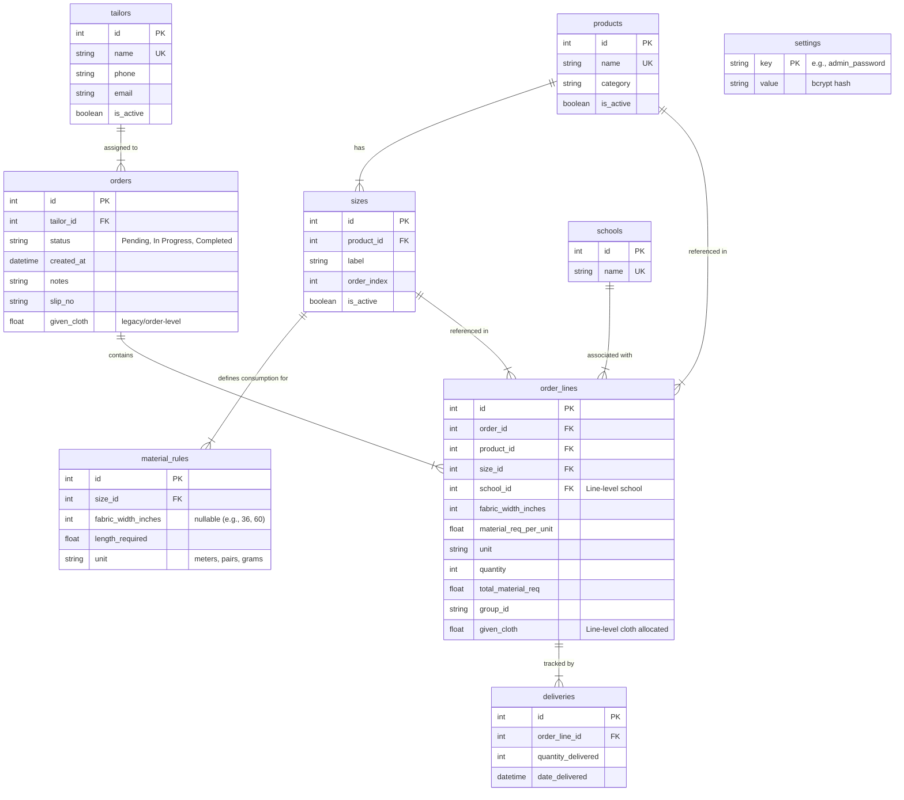

# AGENTS.md - Agent Developer Guide for Tailor Tally

This document serves as the primary technical onboarding guide and architectural blueprint for AI agents and human engineers working on the **Tailor Tally** codebase. Read this document before making code changes, modifying schemas, adding endpoints, or debugging issues.

---

## 1. System Overview & Core Mission

**Tailor Tally** is an **internal business operations, material accounting, and work tracking ledger** used exclusively by the workshop management / shop owner.

> [!IMPORTANT]
> **Not Customer-Facing / Not Tailor-Facing**: End customers (e.g., students, parents, schools) and contracted tailors **never** access or log into this software. It is purely an internal control system for the business to tally, audit, and reconcile materials and work dispatched to tailors.

### The Business Operating Model & Mental Map
The business operates as a central garment manufacturing and uniform supply hub. Production is outsourced or assigned to various specialized tailors (e.g., Ramesh, Suresh, Ganesh, Mahesh).

The software acts as a **bilateral work & material ledger** between the business and each tailor:

```
+------------------------------------------------------------------------------------+
|                                 THE BUSINESS                                       |
|  - Holds school uniform batch contracts & bulk fabric inventory                    |
|  - Configures master data (sizes, fabric roll widths: 36" vs 60", consumption rules)|
+------------------------------------------------------------------------------------+
                                      |
                                      |  1. Dispatches Order Slip + Issues Physical Cloth
                                      v
+------------------------------------------------------------------------------------+
|                             CONTRACTED TAILOR                                      |
|  - Receives work slip (slip_no) specifying items, sizes, schools, and quantities   |
|  - Receives physical fabric bolt/running length (given_cloth)                      |
|  - Sews garments in their workshop                                                 |
+------------------------------------------------------------------------------------+
                                      |
                                      |  2. Returns Finished Garments Incrementally
                                      v
+------------------------------------------------------------------------------------+
|                         INTERNAL TALLY & AUDITING                                  |
|  - Logs partial/full deliveries per line (deliveries table)                        |
|  - Tracks Work Pending: (ordered_qty - delivered_qty) per tailor                   |
|  - Tracks Cloth Accounting: given_cloth vs total_material_req (expected)           |
|  - Reconciles Cloth in Hand: fabric balance currently held by the tailor           |
+------------------------------------------------------------------------------------+
```

### The Core Business Problems It Solves
1. **Material Consumption Rules (36" vs 60" Bolts)**: Different sizes consume different yardage, and fabric rolls come in varying widths (commonly 36-inch and 60-inch rolls). 60-inch fabric requires significantly less running length than 36-inch fabric. Tailor Tally calculates the theoretical requirement dynamically based on catalog rules so the business knows exactly how much cloth the job should consume.
2. **Order Line Customization & Multi-School Grouping**: A single tailor work slip frequently bundles uniforms for multiple schools or distinct apparel types. School associations exist at the **order line level**, not just the order level.
3. **Tailor Job Tracking & Incremental Deliveries**: Raw fabric is issued (`given_cloth`), work is tracked, deliveries are logged incrementally, and order statuses transition automatically (`Pending` -> `In Progress` -> `Completed`).
4. **Cloth Accounting & Tailor Balance (Tallying)**: Shop owners reconcile issued fabric against consumed fabric, identify pending pieces per tailor, monitor how much cloth should currently be with each tailor across all their ongoing jobs, and export print-ready slips and PDF tally reports (`/reports/cloth-tally`).

### Primary Target Environment: Legacy Windows OS & Python 3.8
> [!IMPORTANT]
> **Priority Target: Older Windows PC with Python 3.8**
> - The business runs this application primarily on an **older Windows OS machine** located in the workshop / shop office.
> - **Python 3.8 compatibility is a hard constraint**: Never introduce syntax or language features introduced in Python 3.9+ (such as `type | None` union syntax, `str.removeprefix()`, or built-in collection types as type hints `list[str]` without `from __future__ import annotations`). Always use `typing.Optional`, `typing.List`, `typing.Dict`.
> - **Dependency constraints**: In `backend/pyproject.toml`, libraries are strictly bounded to versions supporting Python 3.8 on Windows (e.g. `numpy<=1.24.4`, `pandas<=2.0.3`, pinned `bcrypt`). Never upgrade packages without verifying Python 3.8 wheel availability on Windows.
> - **Windows Batch Scripts are First-Class Tooling**: The shop owner operates this software by double-clicking Windows `.bat` scripts (`setup.bat`, `run.bat`, `view_db.bat`, `edit_db.bat`). Any changes to launch configurations, dependencies, ports, or startup sequences **must** be reflected in these batch scripts.
> - **Node.js on Windows**: Older Windows systems require `set NODE_SKIP_PLATFORM_CHECK=1` for Vite/Node operations (handled in `run.bat`).
> - **OpenSSL & ReportLab on Windows**: ReportLab's `hashlib.md5(usedforsecurity=False)` breaks on Windows Python 3.8 builds. The `backend/app/hashlib_compat.py` shim is required and must always be imported before ReportLab runs.

### Deployment Topology & Git-Based Production Release Flow
The release model is strictly decoupled into **development machines** and a **single production machine**:

```
+------------------------------------+          git push          +------------------------+
|       DEVELOPMENT MACHINES         | -------------------------> |  REMOTE GIT REPOSITORY |
| - macOS, Linux, Dev Windows        |                            |     (origin/main)      |
| - Feature dev, testing, linting    |                            +------------------------+
+------------------------------------+                                        |
                                                                              | git pull (via run.bat)
                                                                              v
                                                                  +------------------------+
                                                                  |    SHOP WINDOWS PC     |
                                                                  |  (Final Production)    |
                                                                  | - Double-clicks run.bat|
                                                                  | - Auto git pull        |
                                                                  | - Auto update_schema.py|
                                                                  | - Active SQLite DB     |
                                                                  +------------------------+
```

1. **The Shop PC is the Final Production System**: The only production installation that matters lives on the workshop Windows PC. The shop owner never runs terminal commands, Docker, or manual database migrations.
2. **Update Mechanism is Exclusively `git pull` in `run.bat`**: Every morning or whenever the shop owner runs `run.bat`, it executes `git pull`. Any updates pushed to `origin/main` are pulled down immediately before the servers start.
3. **The Zero-Breakage Database Invariant**:
   - The production database (`backend/tailor_tally.db`) holds real historical ledger data (past orders, tailor balances, delivery audits, customer commitments).
   - **Updates must NEVER break or corrupt this database.**
   - Dropping tables, changing data types destructively, or renaming active columns is strictly forbidden.
   - All schema updates must be idempotent and non-destructive via `backend/scripts/update_schema.py` (which `run.bat` runs automatically on startup).

---

## 2. Technology Stack & Architectural Summary

### Backend
- **Language/Runtime**: Python 3.8+ (cross-tested on 3.8, 3.10, 3.11 in CI)
- **Framework**: FastAPI (asynchronous ASGI, OpenAPI/Swagger at `/docs`)
- **ORM**: SQLAlchemy 2.0+
- **Database**: SQLite 3 (located at `backend/tailor_tally.db`, with `PRAGMA foreign_keys=ON`)
- **Validation & Serialization**: Pydantic v2 (`from_attributes=True`)
- **Spreadsheet Ingestion**: Pandas & OpenPyXL (case-insensitive header mapping)
- **PDF Engine**: ReportLab (with custom `hashlib_compat` patch for Python 3.8 / OpenSSL)
- **Security**: Bcrypt (salted password hashing)
- **Package Management**: `uv` or `pip` / `pyproject.toml` (Hatchling build backend)

### Frontend
- **Framework**: React 18 SPA (Vite build tool)
- **Routing**: React Router DOM v6
- **Styling**: Vanilla CSS (`src/index.css` & `src/App.css`) — design tokens, responsive cards, modal sheets
- **Charts/Visualization**: Recharts
- **PDF/Print**: HTML2PDF.js + browser print stylesheets (`PrintableOrder.jsx`)
- **API Client**: Native `fetch` wrapper in `src/api.js` (`http://localhost:8000`)

### Containers & Operations
- **Docker**: Multi-stage `Dockerfile` for backend and frontend
- **Docker Compose**: `docker-compose.yml` (dev mode with hot reload & `sqlite-web` on port 8090) and `docker-compose.prod.yml` (production Nginx on port 80)
- **Windows Automation Scripts**: Batch scripts (`run.bat`, `setup.bat`, `view_db.bat`, `edit_db.bat`)

---

## 3. Directory Structure & File Map

```
tailor-tally/
├── AGENTS.md                       # This file: authoritative agent instructions
├── README.md                       # High-level product overview and user guide
├── docker-compose.yml              # Local dev stack (backend, frontend, sqlite-web)
├── docker-compose.prod.yml         # Production container stack (Nginx + Uvicorn)
├── run.bat / setup.bat             # Windows setup & launch automation
├── view_db.bat / edit_db.bat       # Windows database inspection helpers
├── verify_school.py                # Standalone E2E verification test against running server
├── master_data_*.xlsx / .csv       # Catalog seed templates (36", 60", etc.)
├── backend/
│   ├── pyproject.toml              # Dependencies, hatchling config, pytest settings
│   ├── uv.lock                     # Locked python dependency graph
│   ├── Dockerfile                  # Python 3.11 slim container definition
│   ├── tailor_tally.db             # ACTIVE SQLite database file used by backend
│   ├── check_admin.py / fix_admin.py # Standalone admin password recovery & verify tools
│   ├── app/
│   │   ├── __init__.py
│   │   ├── main.py                 # FastAPI app entrypoint, CORS, router mounting
│   │   ├── database.py             # SQLite engine, SessionLocal, get_db dependency
│   │   ├── models.py               # SQLAlchemy ORM models (Product, Order, OrderLine, etc.)
│   │   ├── schemas.py              # Pydantic v2 schemas for requests & responses
│   │   ├── hashlib_compat.py       # Python 3.8/OpenSSL patch for ReportLab md5
│   │   ├── seed.py                 # Initial DB seeder (tailors, products, sizes, schools, admin)
│   │   ├── routers/
│   │   │   ├── orders.py           # Orders CRUD, delivery recording, status transitions
│   │   │   ├── reports.py          # Cloth tally summary & ReportLab PDF generation
│   │   │   ├── master_data.py      # Products, sizes, rules, tailors, bulk spreadsheet upload
│   │   │   ├── schools.py          # Schools list & creation
│   │   │   ├── dashboard.py        # Aggregated shop metrics & chart data
│   │   │   └── admin.py            # Password verification & change endpoints
│   │   └── utils/
│   │       ├── security.py         # Bcrypt hash and verify utilities
│   │       ├── email_utils.py      # Simulated tailor order dispatch formatting
│   │       └── import_utils.py     # Fuzzy spreadsheet parser for bulk master data
│   ├── scripts/
│   │   ├── update_schema.py        # Safe SQLite column migrator (ALTER TABLE ADD COLUMN)
│   │   ├── update_master_data.py   # CLI tool to bulk-import master data spreadsheet
│   │   ├── view_db.py              # Dumps DB tables into HTML report (db_view.html)
│   │   └── edit_db.py              # Runs interactive sqlite-web browser
│   └── tests/
│       ├── conftest.py             # Pytest fixtures: test DB isolation & rollback
│       ├── test_suite.py           # Core order lifecycle, calculations, security tests
│       ├── test_flow.py            # End-to-end order flow and delivery logging
│       ├── test_edit_protection.py # Header security (X-Admin-Password) validation
│       ├── test_orders_search.py   # Order searching, sorting, and status filtering
│       ├── test_reports.py         # Cloth tally math, school filter, and PDF output tests
│       └── reproduce_issue.py      # Ad-hoc issue reproduction script
└── frontend/
    ├── package.json                # Dependencies: React 18, Vite, React Router, Recharts
    ├── vite.config.js              # Vite configuration
    ├── Dockerfile                  # Multi-stage dev & Nginx production container
    ├── index.html                  # HTML entry point
    └── src/
        ├── main.jsx                # React DOM root mounting
        ├── App.jsx                 # Route declarations & notification provider wrapper
        ├── api.js                  # Centralized fetch wrapper (fetchAPI)
        ├── utils.js                # Shared utility functions
        ├── index.css / App.css     # Global styles, variables, responsive layout
        ├── components/
        │   ├── Navbar.jsx          # Top navigation bar
        │   ├── Notification.jsx    # Toast notification context & component
        │   ├── Combobox.jsx        # Searchable autocomplete dropdown
        │   └── PrintableOrder.jsx  # Print slip layout for physical tailor tickets
        └── pages/
            ├── Dashboard.jsx       # Shop statistics, KPIs, Recharts charts
            ├── OrderList.jsx       # Paginated/filtered orders table
            ├── CreateOrder.jsx     # Multi-line order creator with dynamic consumption
            ├── OrderDetails.jsx    # Order view, partial deliveries, edit line modal
            ├── Reports.jsx         # Cloth tally reports and PDF download UI
            ├── MasterData.jsx      # Products, sizes, fabric rules, spreadsheet importer
            └── AdminSettings.jsx   # Admin password management
```

---

## 4. Domain Models & Relational Schema



### Critical Schema Rules & Invariants
1. **Active Database Location**: The backend uses `backend/tailor_tally.db` (resolved relative to `backend/app/database.py`). An existing `tailor_tally.db` in the project root is an artifact/backup and is **not** connected to the active API.
2. **Foreign Key Enforcement**: `backend/app/database.py` attaches a listener to SQLAlchemy's Engine connect event to execute `PRAGMA foreign_keys=ON`. Foreign key integrity is strictly enforced at the SQLite level.
3. **Multi-School Architecture**: `school_id` belongs to `order_lines`, **not** `orders`. Orders can contain items for multiple different schools.
4. **Calculated Line Snapshot**: `OrderLine` stores snapshot values (`material_req_per_unit`, `unit`, `fabric_width_inches`, `total_material_req`) captured at order creation time. Changes to master data rules do not silently corrupt past orders unless explicitly triggered via `POST /orders/{order_id}/refresh`.
5. **The Zero-Breakage Database Invariant (Strict Production Rule)**:
   - Because the workshop PC syncs changes automatically via `git pull` in `run.bat` without developer oversight, **the production database must NEVER break or lose existing data**.
   - **Nullable or Defaulted Columns Only**: Any new column added to existing SQLite tables must be `nullable=True` (or define a constant default value). SQLite forbids `ALTER TABLE ADD COLUMN` with a `NOT NULL` constraint unless a constant default is specified.
   - **Never Drop or Rename Columns**: If a column becomes obsolete (e.g., `orders.school_id` or `orders.given_cloth`), preserve it in the model as an optional/deprecated field. Never drop columns or re-create production tables.
   - **All Migrations Registered in `update_schema.py`**: Any schema addition must be added to `backend/scripts/update_schema.py` using `add_column_if_not_exists(...)`. When `run.bat` pulls code, it runs this script before booting Uvicorn, guaranteeing seamless schema evolution in-place.

---

## 5. Core Business Logic & State Machines

### 1. Material Requirement Calculations
- `total_material_req = quantity * material_req_per_unit`
- When selecting a size and fabric width (e.g. 36" vs 60"):
  - Query `material_rules` matching `size_id` and `fabric_width_inches`.
  - If no width is specified or matched, fall back to the first rule for that `size_id`.
  - If no rule exists, reject creation with `HTTP 400`.
- Non-fabric units:
  - Shoes have `length_required = 0` with `unit = "pairs"`.
  - Sports items may have unit `"grams"`.
  - Standard fabrics have unit `"meters"`.

### 2. Order Status State Machine
Order status is dynamically derived based on all line deliveries:
- **`Pending`**: Total delivered quantity across all lines is `0`.
- **`In Progress`**: Total delivered quantity > 0, but at least one line has `delivered_qty < quantity`.
- **`Completed`**: For every order line, `delivered_qty >= quantity`.
- **Bidirectional Recalculation**: If a delivery is deleted (`DELETE /orders/deliveries/{id}`), the order status is automatically recalculated backwards (e.g., `Completed` -> `In Progress` or `Pending`).

### 3. Admin Security & Edit Protection
Sensitive mutations are locked behind admin authorization. The client must supply the header:
```http
X-Admin-Password: <admin_password>
```
Endpoints requiring this header:
- `PUT /orders/{order_id}` (edit order metadata)
- `PUT /orders/lines/{line_id}` (edit line quantities, schools, cloth)
- `DELETE /orders/{order_id}` (delete entire order)
- `DELETE /orders/lines/{line_id}` (delete order line)
- `DELETE /orders/deliveries/{delivery_id}` (delete recorded delivery)

Password verification compares the raw string against the bcrypt hash stored in the `settings` table under `key = 'admin_password'`. Default password is `admin`.

### 4. Tailor Work & Cloth Accounting Math (The Tally System)
The core operational purpose of the app is maintaining an exact tally of:
1. **Physical Cloth Handed Out (`given_cloth`)**: Total raw material issued by the business to the tailor for an order line or slip.
2. **Standard Cloth Requirement (`total_material_req`)**: Theoretical benchmark calculated from master data:
   $$\text{total\_material\_req} = \text{quantity} \times \text{material\_req\_per\_unit}$$
3. **Cloth Consumed in Delivered Work (`cloth_used`)**:
   $$\text{cloth\_used} = \text{delivered\_qty} \times \text{material\_req\_per\_unit}$$
4. **Cloth Required for Pending Work (`cloth_pending`)**:
   $$\text{cloth\_pending} = \text{pending\_qty} \times \text{material\_req\_per\_unit}$$
5. **Tailor Cloth Balance & Material in Hand**:
   - **Balance / Variance**: $\text{given\_cloth} - \text{total\_material\_req}$ (determines if the tailor was over-supplied or under-supplied relative to standard rules).
   - **Estimated Material in Hand**: $\text{given\_cloth} - \text{cloth\_used}$ (approximate raw cloth the tailor should still physically have in their shop).
6. **Cross-Order Aggregation (`GET /reports/cloth-tally`)**:
   - Summarizes across all open orders per tailor:
     - Total pieces ordered vs. delivered vs. pending.
     - Total cloth issued (`given_cloth`) vs. required vs. consumed.
     - Schools involved in the tailor's active workload.

---

## 6. How to Run, Test, and Debug

### Setting Up the Environment

#### Option A: Windows Workshop Environment (Primary Production Route)
The shop owner runs the application via automated Windows batch files (`.bat`):

1. **One-Time Initialization (`setup.bat`)**:
   ```cmd
   setup.bat
   ```
   - Creates a Windows Python virtual environment (`backend\venv`).
   - Upgrades `pip` and installs the backend package in editable mode (`pip install .`).
   - Navigates to `frontend\` and executes `npm install`.

2. **Daily Launch & Auto-Update (`run.bat`)**:
   ```cmd
   run.bat
   ```
   - Fetches upstream Git updates (`git pull`).
   - Detects changes in `backend/pyproject.toml` or `frontend/package.json` and updates packages automatically.
   - Verifies Python dependencies (checks for `reportlab`).
   - Executes dynamic schema migrations (`python scripts/update_schema.py`).
   - Enforces `NODE_SKIP_PLATFORM_CHECK=1` for older Windows compatibility.
   - Launches 3 concurrent process windows:
     - **Backend**: `uvicorn app.main:app --host 0.0.0.0 --port 8000`
     - **Frontend**: `npm run dev` (Port 5173)
     - **Database Explorer**: `sqlite_web tailor_tally.db --port 8090 --no-browser`
   - Automatically opens default web browser to `http://localhost:5173`.

3. **Database Maintenance Helpers**:
   - `view_db.bat`: Dumps SQLite tables to a standalone HTML file (`backend/db_view.html`) and opens it in the browser.
   - `edit_db.bat`: Launches interactive `sqlite-web` interface on port 8090.

---

#### Option B: Developer CLI Setup (macOS / Linux / WSL / Developer Windows)

##### Using `uv` (Fastest)
```bash
# Backend Setup
cd backend
uv venv --python 3.8       # Strictly test against Python 3.8 whenever possible
source .venv/bin/activate  # On Windows: .venv\Scripts\activate
uv pip install -e .
uv pip install httpx       # Required for pytest TestClient

# Seed Database (creates default tailors, catalog, schools, admin password)
uv run python app/seed.py

# Run Schema Verification
uv run python scripts/update_schema.py

# Frontend Setup
cd ../frontend
npm install
```

##### Using Standard `python` + `pip`
```bash
cd backend
python3 -m venv .venv
source .venv/bin/activate  # On Windows: .venv\Scripts\activate
python -m pip install --upgrade pip
pip install .
pip install httpx pytest
python app/seed.py
python scripts/update_schema.py

cd ../frontend
npm install
```

---

### Running Development Servers

1. **Backend Server** (Port 8000):
   ```bash
   cd backend
   uvicorn app.main:app --host 0.0.0.0 --port 8000 --reload
   ```
   API Docs: `http://localhost:8000/docs`

2. **Frontend Server** (Port 5173):
   ```bash
   cd frontend
   npm run dev
   ```
   Web Interface: `http://localhost:5173`

3. **Database Web Inspector** (Port 8090, optional):
   ```bash
   cd backend
   sqlite_web tailor_tally.db --port 8090 --no-browser
   ```

---

### Running Tests

The test suite uses `pytest` with FastAPI's `TestClient`.

> [!IMPORTANT]
> `starlette.testclient` requires `httpx`. When running tests via `uv`, always ensure `httpx` is included in the environment or passed via `--with httpx`.

```bash
# Run all backend tests
cd /Users/mo/Developer/tailor-tally
uv run --project backend --with httpx pytest backend/tests

# Run tests with standard venv
cd backend
pytest

# Run a specific test file with verbose output
uv run --project backend --with httpx pytest backend/tests/test_reports.py -v -s

# Run with keyword filter
uv run --project backend --with httpx pytest backend/tests -k "test_security"
```

#### How the Test Suite Operates (`conftest.py`)
- `conftest.py` spins up a dedicated `test.db` file (`backend/test.db`), creates all tables, and runs `db_seed()`.
- Each test runs inside a nested database transaction. The function-scoped `db` fixture rolls back all changes on teardown, guaranteeing isolation without re-creating SQLite tables on every test.
- The `client` fixture overrides the `get_db` FastAPI dependency to use this transactional session.

#### Frontend Build & Lint Verification
```bash
cd frontend
npm run build   # Validates Vite bundle generation
npm run lint    # ESLint check
```

#### Standalone End-to-End Test (`verify_school.py`)
Ensure the backend server is running on `http://localhost:8000`, then run:
```bash
python3 verify_school.py
```
This tests live API school queries, tailor queries, multi-school multi-line order dispatching, and relational school filtering.

---

## 7. Developer Playbook: How to Safely Make Changes

### A. Adding a New Column / Schema Migration
Because SQLite lacks a full ORM migration runner like Alembic in this project and the shop Windows machine updates unattended via `git pull` in `run.bat`, schema evolution is handled deterministically via `backend/scripts/update_schema.py`:
1. **Update ORM Model**: Add the column in `backend/app/models.py`. **Must be `nullable=True` or specify a constant default** so SQLite can backfill pre-existing production rows without error.
2. **Update Pydantic Schemas**: Add the field to create, update, and read schemas in `backend/app/schemas.py`.
3. **Add Migration Logic**: In `backend/scripts/update_schema.py`, add an `add_column_if_not_exists(cursor, table, column, sql_type)` call.
4. **Update `update_master_data.py` / `import_utils.py`** if the column affects spreadsheet importing.
5. **Update Routers & Response Mappers**: Update mapping functions (e.g. `map_order_response` in `orders.py`).
6. **Write Automated Tests**: Add test cases verifying creation, persistence, and retrieval in `backend/tests/`.
7. **Verify Non-Destructive Behavior**: Ensure `python scripts/update_schema.py` runs cleanly against an existing database without dropping or recreating tables.

### B. Adding a New API Router / Feature
1. Create `backend/app/routers/your_feature.py` with an `APIRouter(prefix="/your-feature", tags=["your-feature"])`.
2. Register the router in `backend/app/main.py`:
   ```python
   from .routers import your_feature
   app.include_router(your_feature.router)
   ```
3. Use dependency injection for DB access (`db: Session = Depends(get_db)`).
4. If the endpoint mutates protected operational data, enforce `X-Admin-Password`:
   ```python
   x_admin_password: str = Header(None, alias="X-Admin-Password")
   ```
5. Add client methods in `frontend/src/api.js` using `fetchAPI`.
6. Add unit/integration tests in `backend/tests/`.

### C. Modifying Fabric Consumption or Pricing Rules
- Any logic change to how `material_req_per_unit` is calculated must respect the snapshot design: existing orders should keep their stored numbers unless `POST /orders/{id}/refresh` is called.
- Ensure tests in `test_suite.py` (`test_order_creation_and_consistency` and `test_order_refresh_master_data`) continue to pass.

---

## 8. Critical Gotchas & Troubleshooting

| Issue | Root Cause | Solution |
| :--- | :--- | :--- |
| `RuntimeError: The starlette.testclient module requires the httpx package to be installed` | `httpx` is missing from the Python virtualenv. | Run `uv pip install httpx` or run pytest with `--with httpx`. |
| `TypeError: usedforsecurity is an invalid keyword argument for openssl_md5()` | ReportLab passes `usedforsecurity=False` to `hashlib.md5`, which breaks on Python 3.8 / certain OpenSSL builds. | Ensure `from . import hashlib_compat` is imported at the top of `backend/app/main.py` and `backend/app/routers/reports.py`. |
| `TypeError: unsupported operand type(s) for |: 'type' and 'NoneType'` | Python 3.9+ type union syntax (`X | None`) used in a Python 3.8 environment. | Use `typing.Optional[X]` or `typing.Union[X, None]`. Maintain strict Python 3.8 syntax. |
| Node.js fails to start on older Windows OS | Node.js engine checks fail on legacy Windows releases. | Ensure `set NODE_SKIP_PLATFORM_CHECK=1` is present before `npm` commands (already included in `run.bat`). |
| Windows `.bat` fails with syntax errors | CRLF line endings altered or shell syntax unsupported by `cmd.exe`. | Test batch files in Command Prompt (`cmd.exe`). Avoid Linux-only bashisms in `.bat` scripts. |
| Admin authentication fails (`401 Unauthorized`) | Default password hash missing or altered in `settings` table. | Run `python backend/fix_admin.py` to reset the password to `admin`. Inspect with `python backend/check_admin.py`. |
| Database changes not showing up in web app | Editing the root `tailor_tally.db` instead of `backend/tailor_tally.db`. | The app runs exclusively against `backend/tailor_tally.db`. Always use this path for direct SQLite edits or inspections. |
| Vite build warns about large chunk sizes | Recharts, html2pdf.js, and React vendor code bundled in single chunk. | Normal for current build configuration, but dynamic `import()` or Rollup manual chunking can be added in `vite.config.js` if necessary. |
| ESLint errors on `require` in `vite.config.js` | CommonJS syntax in ESM Vite project. | Use standard ES `import` statements in `vite.config.js`. |

---

## 9. Quality & Contribution Standards

When submitting changes as an agent or engineer:
1. **Python 3.8 & Windows Compatibility is Mandatory**:
   - The primary deployment is an older Windows workshop PC running Python 3.8.
   - Never use Python 3.9+ features (e.g. `type | None`, `str.removeprefix()`, `match/case`).
   - All CI tests in `.github/workflows/test.yml` validate against Python 3.8, 3.10, and 3.11. A pull request that breaks Python 3.8 is an immediate failure.
2. **Preserve Windows Batch Tooling**:
   - `run.bat` and `setup.bat` are how the business owner operates the app daily. If you add dependencies, change ports, or alter launch sequences, you **must** update the corresponding `.bat` scripts.
3. **Never commit hardcoded secrets**: Passwords must always be hashed via `get_password_hash` in `backend/app/utils/security.py`.
4. **Zero-Breakage Production Database Guarantee**:
   - Updates to the production Windows machine are pulled automatically via `git pull` in `run.bat`.
   - Never delete existing database tables, alter column types destructively, or rename active columns.
   - All migrations must be registered in `backend/scripts/update_schema.py` and must be strictly additive and backward compatible with pre-existing SQLite data.
   - Never commit `tailor_tally.db` or overwrite the shop's operational database file.
5. **Always preserve foreign keys**: Ensure cascade deletes or relational cleanups are handled on dependent models (`OrderLine` -> `Delivery`, `Product` -> `Size` -> `MaterialRule`).
6. **All tests must pass**: Run `uv run --project backend --with httpx pytest backend/tests` and confirm 100% pass rate before concluding tasks.
7. **Keep git commits atomic & well-described**: Follow Conventional Commits format (`feat: ...`, `fix: ...`, `docs: ...`, `refactor: ...`, `test: ...`).
