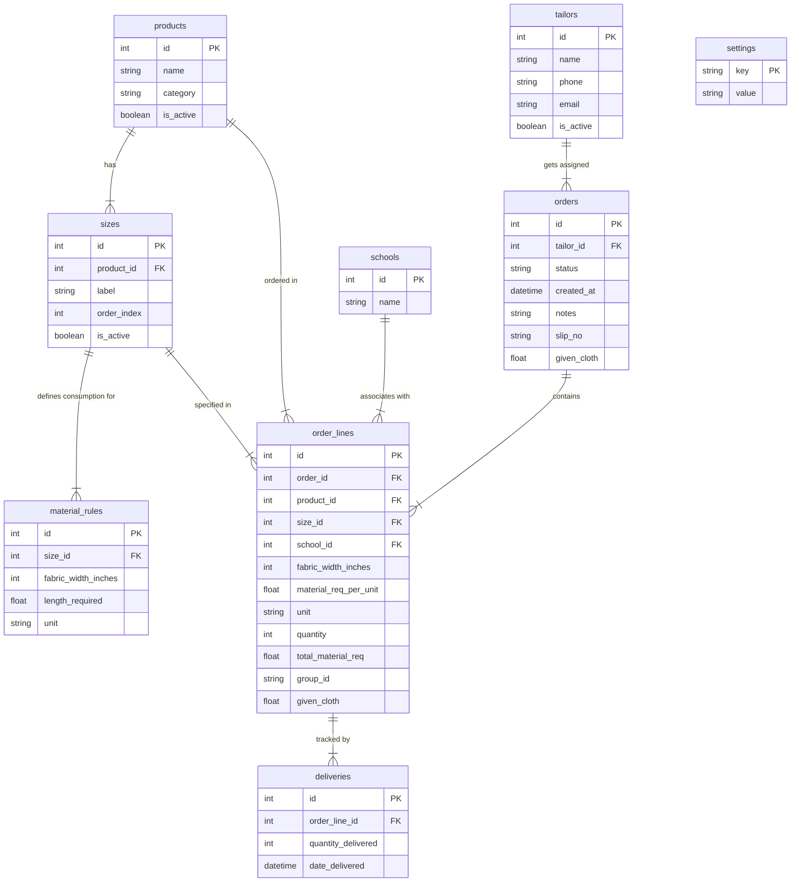

# Tailor Tally

Tailor Tally is a comprehensive, modern management and material tracking system designed for tailor shops and custom apparel manufacturers. It is highly optimized for batch ordering systems, such as school uniform programs, but fully adaptable to custom tailoring services of any scale. 

The application helps shop owners automate the complex process of calculating fabric requirements, tracking tailor allocations, managing deliveries, and visualizing business performance.

---

## Table of Contents

- [Aim of the Application](#aim-of-the-application)
- [Key Features](#key-features)
  - [1. Dashboard \& Real-Time Analytics](#1-dashboard--real-time-analytics)
  - [2. Master Data Management](#2-master-data-management)
  - [3. Order \& Job Tracking](#3-order--job-tracking)
  - [4. Tailor Management](#4-tailor-management)
  - [5. Admin Settings \& Security](#5-admin-settings--security)
- [Technical Architecture](#technical-architecture)
  - [Tech Stack](#tech-stack)
  - [Database Schema Model](#database-schema-model)
  - [Project Directory Structure](#project-directory-structure)
- [Getting Started](#getting-started)
  - [Prerequisites](#prerequisites)
  - [Option A: Automated Setup (Windows)](#option-a-automated-setup-windows)
  - [Option B: Manual Setup (macOS / Linux / WSL)](#option-b-manual-setup-macos-linux-wsl)
  - [Option C: Docker Container Setup](#option-c-docker-container-setup)
- [Database \& Script Utilities](#database--script-utilities)
  - [Database Seeding](#database-seeding)
  - [HTML Database Viewer](#html-database-viewer)
  - [Interactive DB Admin Interface](#interactive-db-admin-interface)
  - [Schema Migrations](#schema-migrations)
  - [Verification Script](#verification-script)

---

## Aim of the Application

In custom tailoring and uniform supply businesses, matching orders to material constraints is a major operational challenge. Tailors work with fabrics of varying widths (e.g., 36-inch or 60-inch rolls), and different sizes of apparel consume different amounts of material. 

**Tailor Tally** solves this by:
* **Eliminating Manual Calculations**: Automatically calculating precise fabric requirements based on the apparel item, the customer's size, and the fabric width.
* **Streamlining Order Allocation**: Assigning jobs to specific tailors, tracking raw materials issued, and recording partial or full product deliveries.
* **Centralizing Operations**: Combining school records, customer orders, inventory constraints, and billing slips in a single, secure database.

---

## Key Features

### 1. Dashboard & Real-Time Analytics
* **Overview Metrics**: Track active orders, total material issued, total work completed, and remaining work pending.
* **Top Performance Visualizations**: Uses interactive charts to display top-ordered products and the tailors handling the highest order volume.
* **Material Tracking**: Live indicators showing material usage efficiency and progress.

### 2. Master Data Management
* **Products & Sizes**: Manage a database of apparel types (e.g., Blazers, Body Frocks, Pants, Shirts) and their respective sizes.
* **Material Consumption Rules**: Configure exactly how many meters (or units) of fabric are needed per size. Rules can be defined based on the width of the fabric roll (e.g., 36 inches vs. 60 inches) so that material consumption is minimized.
* **Bulk Imports**: Upload master data files in Excel (`.xlsx`) or CSV (`.csv`) formats to seed or update the product catalog and material rules in seconds.

### 3. Order & Job Tracking
* **Comprehensive Order Creation**: Create orders linked to specific tailors, containing slip numbers, customized notes, and multiple order lines.
* **Per-Line Customization**: For each line item in an order, specify the Product, Size, School (individualized per item for mixed-school orders), Fabric Width, Quantity, and Given Cloth.
* **Automated Material Estimation**: Instantly calculates the required material per unit and the total material required for the line item.
* **Delivery Logging**: Track deliveries incrementally. Log partial quantities as they are completed. The system automatically shifts the order status from `Pending` $\rightarrow$ `In Progress` $\rightarrow$ `Completed` as items are delivered.
* **Printable Summaries**: Generate formatted, print-ready layouts of tailoring orders directly from the web browser.

### 4. Tailor Management
* **Tailor Profiles**: Manage active tailors, including phone numbers and email addresses.
* **Automatic Notifications**: When an order is created, the system can automatically send a structured email to the assigned tailor detailing their tasks, materials, and notes (email sending is simulated in local logs).

### 5. Admin Settings & Security
* **Access Control**: Secure settings and data import tools behind an admin password.
* **Password Management**: Update current passwords from the settings page securely using hashed encryption.

---

## Technical Architecture

### Tech Stack
* **Backend Framework**: **FastAPI** (Python 3.8+) - High performance, asynchronous routing, automatic API documentation (Swagger/OpenAPI).
* **Database & ORM**: **SQLAlchemy** with **SQLite** - Clean object-relational mapping, thread-safe connections, and local single-file database simplicity.
* **Frontend Library**: **React** (built with **Vite**) - Fast Hot Module Replacement (HMR), component-driven interface, and responsive page routing.
* **Data Science/File Processing**: **Pandas** & **OpenPyXL** - Fast spreadsheet validation and parsing.
* **Security**: **Bcrypt** - Industry-standard secure password hashing.
* **Visualization**: **Recharts** - Dynamic, interactive client-side charts.
* **Containerization**: **Docker** & **Docker Compose** - Consistent dev and production environments.

### Database Schema Model




## Getting Started

### Prerequisites
* **Python**: Version 3.8 or higher.
* **Node.js**: Version 16 or higher (including `npm`).
* **Git**: To clone and pull updates.
* **Docker** *(Optional)*: If you prefer containerized runtimes.

---

### Option A: Automated Setup (Windows)

1. **First-time Setup**:
   Double-click `setup.bat` or run it in Command Prompt:
   ```cmd
   setup.bat
   ```
   *This creates a Python virtual environment (`venv`), upgrades `pip`, installs backend packages, and installs frontend node modules.*

2. **Run the Application**:
   Double-click `run.bat` or run it in Command Prompt:
   ```cmd
   run.bat
   ```
   *This pulls git updates, applies database migrations, launches the FastAPI server (Port `8000`), launches the Vite server (Port `5173`), starts the DB database viewer (Port `8090`), and opens your default web browser.*

---

### Option B: Manual Setup (macOS / Linux / WSL)

If you are running on macOS, Linux, or WSL, run the following commands in your terminal:

1. **Setup the Backend**:
   ```bash
   cd backend
   python3 -m venv .venv
   source .venv/bin/activate
   python3 -m pip install --upgrade pip
   pip install .
   ```

2. **Seed and Run Migrations**:
   While inside the backend directory with active virtualenv:
   ```bash
   # Seed default database and admin credentials
   python3 app/seed.py
   
   # Run schema migration checks
   python3 scripts/update_schema.py
   ```

3. **Setup the Frontend**:
   Open a new terminal window at the project root:
   ```bash
   cd frontend
   npm install
   ```

4. **Launch the Services**:
   * **Start Backend** (inside `backend` with active virtualenv):
     ```bash
     uvicorn app.main:app --host 0.0.0.0 --port 8000 --reload
     ```
   * **Start Frontend** (inside `frontend`):
     ```bash
     npm run dev
     ```
   * **Start SQLite DB Web Viewer** (inside `backend` with active virtualenv):
     ```bash
     sqlite_web tailor_tally.db --port 8090 --no-browser
     ```

   Open your browser and navigate to:
   * **Web App**: [http://localhost:5173](http://localhost:5173)
   * **API Docs (Swagger)**: [http://localhost:8000/docs](http://localhost:8000/docs)
   * **SQLite Web Explorer**: [http://localhost:8090](http://localhost:8090)

---

### Option C: Docker Container Setup

You can build and deploy the entire application using containers.

* **Development Mode (Hot Reloading Active)**:
  ```bash
  docker-compose up --build
  ```
  * Backend hot reloads at [http://localhost:8000](http://localhost:8000)
  * Frontend dev server runs at [http://localhost:5173](http://localhost:5173)
  * SQLite web inspector runs at [http://localhost:8090](http://localhost:8090)

* **Production Mode (Nginx Serving Frontend)**:
  ```bash
  docker-compose -f docker-compose.prod.yml up --build -d
  ```
  * The production Nginx server serves the compiled frontend bundle directly on standard HTTP Port [http://localhost:80](http://localhost:80).
  * Backend runs containerized on Port `8000`.

---

## Database & Script Utilities

### Database Seeding
Upon first startup, `seed.py` creates a default admin user, seeds four initial tailors (`Ramesh`, `Suresh`, `Ganesh`, `Mahesh`), initializes a comprehensive catalog of products and sizes, creates default fabric rules, and populates the database with over 50 schools.
* **Default Admin Password**: `admin`

### HTML Database Viewer
For a quick, read-only HTML report of your database tables, run:
```bash
# Windows
view_db.bat

# macOS / Linux (from backend directory)
python3 scripts/view_db.py
```
This writes a beautiful, responsive HTML file containing tabular dumps of all records at `backend/db_view.html` and automatically opens it in your default web browser.

### Interactive DB Admin Interface
The system integrates `sqlite-web` (an interactive, web-based SQLite manager) served automatically on port `8090` during standard runs. Use this to perform manual SQL queries, browse tables, or export CSV records directly from a GUI.

### Schema Migrations
The script `backend/scripts/update_schema.py` runs automatically on boot when using `run.bat` or manually via python. It checks the SQLite database schema dynamically, adding missing fields (such as `given_cloth`, `slip_no`, `school_id`, or `group_id` columns) if tables are pre-existing, preventing database corruption when pulling new updates.

### Verification Script
An end-to-end API integration and workflow verification script is provided at the root:
```bash
python3 verify_school.py
```
*Make sure the backend is running at `http://localhost:8000` before running.* This script automatically executes a test suite covering school query APIs, tailor lookup, mixed-school multi-line order dispatching, and validates the relational integrity of the schema.
